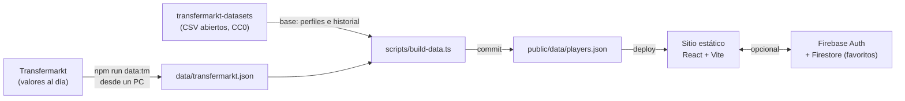

# NextPlayer

Ranking de los futbolistas que más se revalorizaron en el último año. Filtra por posición, liga y edad, abre la ficha de cada jugador con la evolución de su valor y guarda a tus favoritos.

> Versión 2. La [primera versión](https://github.com/gianni28/frontendNextPlayer) (2024) era un proyecto de universidad con React + Express + Firebase y un scraper propio. Esta es una reescritura completa con foco en datos confiables, seguridad y rendimiento.

## Qué hace

- **Ranking** por aumento de valor en euros, en porcentaje, por valor actual o por edad.
- **Filtros** por posición, liga, edad máxima y búsqueda por jugador o club (sin importar tildes). Los filtros viven en la URL, así que cualquier búsqueda se puede compartir.
- **Ficha del jugador** con una gráfica de la evolución de su valor (SVG hecho a mano, sin librerías) y sus datos básicos.
- **Favoritos** opcionales con cuenta de Google o correo. Ver el ranking no requiere cuenta.
- Funciona en celular y en computador, en modo claro y oscuro, y con teclado.

## Arquitectura



No hay servidor propio. El dataset abierto da la base (perfiles e historial) y los valores recientes se consultan a Transfermarkt y se guardan en `data/transfermarkt.json`. Un script descarga todo, calcula el ranking y publica el resultado como un JSON estático. La app lo lee directamente, así que carga al instante y no sufre los *cold starts* de un backend gratuito. El SDK de Firebase se carga bajo demanda para no retrasar el ranking.

### Decisiones y por qué

| Antes (v1) | Ahora (v2) | Por qué |
| --- | --- | --- |
| Scraper propio a Transfermarkt (se perdió) | Dataset abierto (CC0) como base + consulta propia de valores recientes | El dataset da la base reproducible; la consulta lo mantiene al día desde que el dataset se pausó |
| Datos como texto (`"12,50 mill. €"`) parseados en el navegador | Números en EUR calculados en el pipeline | Menos lógica en el cliente y sin errores de parseo |
| Express en Render con cold start de ~50 s | JSON estático en CDN | Carga instantánea y costo cero |
| Contraseñas en texto plano en Firestore | Firebase Authentication | Las contraseñas nunca pasan por nuestro código |
| "Sesión" = `localStorage.isAuthenticated = true` | Sesión real de Firebase + reglas de Firestore | Nadie puede leer ni escribir datos de otro usuario |
| Login obligatorio para ver datos públicos | Login opcional, solo para favoritos | Menos fricción |
| Create React App (deprecado) | Vite + TypeScript estricto | Build rápido y tipos compartidos entre el pipeline y la app |

## Cómo se calcula el ranking

`scripts/lib/compute.ts` (con pruebas en `compute.test.ts`):

1. Toma la valoración más reciente de cada jugador.
2. La compara con su última valoración **anterior** al inicio de la ventana de 12 meses, para no comparar contra un dato que aún no existía.
3. Descarta jugadores sin valoraciones en los últimos 9 meses y a los que no tienen con qué compararse.
4. Ordena por aumento en euros y guarda los 1.500 primeros, con un historial de 3 años submuestreado a 18 puntos para las gráficas.

## Actualizar con datos al día

El dataset abierto pausó sus actualizaciones en julio de 2026 porque Transfermarkt dejó de responder a GitHub Actions. Por eso los valores recientes se consultan **desde un PC**:

- **Windows:** doble clic en `actualizar-datos.cmd`. En macOS o Linux: `./actualizar-datos.sh`.
- El script descarga la base, consulta el gráfico de valor de mercado de cada jugador en Transfermarkt (hasta 4.000 por corrida, unos 15 minutos), recalcula el ranking y sube `public/data/players.json` y `data/transfermarkt.json`. Netlify publica solo.
- Cada corrida consulta primero a los que nunca se han consultado o llevan más tiempo sin consultarse, entre activos menores de 32 años y con valor de al menos 500 mil €. Se puede cortar con Ctrl+C y seguir después: lo avanzado se guarda.
- Además del valor, toma el club de la valoración más reciente, así los fichajes posteriores al dataset quedan bien.
- Si Transfermarkt rechaza muchas consultas seguidas, se detiene sin perder lo avanzado.

Para que corra solo cada semana (Windows), en una terminal:

```bat
schtasks /Create /SC WEEKLY /D MON /ST 09:00 /TN "NextPlayer datos" /TR "\"C:\ruta\a\nextplayer\actualizar-datos.cmd\" /auto"
```

El workflow semanal de GitHub sigue funcionando: usa los valores guardados en `data/transfermarkt.json`, sin consultar Transfermarkt.

> Los valores son estimaciones de Transfermarkt y se leen de su sitio con pocas consultas y pausas entre ellas, para uso personal y no comercial. Transfermarkt no actualiza valores a diario: lo hace por rondas, varias veces al año por liga.

## Desarrollo local

```bash
npm install
npm run data         # descarga el dataset real (~1 min)
# o, sin internet:
npm run data:sample  # datos INVENTADOS, marcados con un aviso en la app
npm run dev
```

| Comando | Qué hace |
| --- | --- |
| `npm run dev` | Servidor de desarrollo |
| `npm run build` | Revisa tipos y genera `dist/` |
| `npm test` | Pruebas con Vitest (pipeline, filtros, formato y errores de login) |
| `npm run lint` | ESLint |
| `npm run data` | Regenera `public/data/players.json` con la base y los valores guardados |
| `npm run data:tm` | Igual, pero antes consulta Transfermarkt (desde un PC) |

## Cuentas y favoritos (opcional)

1. Crea un proyecto en [Firebase](https://console.firebase.google.com), activa **Authentication** (Google y Correo/contraseña) y **Firestore**.
2. Copia `.env.example` a `.env` y llena las cuatro variables de la app web. En el hosting, agrégalas como variables de entorno.
3. Publica las reglas de `firestore.rules` (Firestore → Reglas).
4. En Authentication → Configuración → Dominios autorizados, agrega el dominio donde publiques la app.

Sin estas variables la app funciona igual; simplemente no muestra el botón de entrar ni los favoritos.

## Despliegue

Incluye configuración para **Netlify** (`netlify.toml` + `public/_redirects`) y **Vercel** (`vercel.json`). Conecta el repo y cada push a `main` se publica solo. Después de crear el repo, ejecuta una vez el workflow **Actualizar datos** (pestaña Actions → Run workflow) para generar el primer ranking.

## Créditos

- Datos: [transfermarkt-datasets](https://github.com/dcaribou/transfermarkt-datasets) de dcaribou (CC0-1.0), basados en valores de mercado de [Transfermarkt](https://www.transfermarkt.com).
- Código: MIT © Giovanni Raffa.
